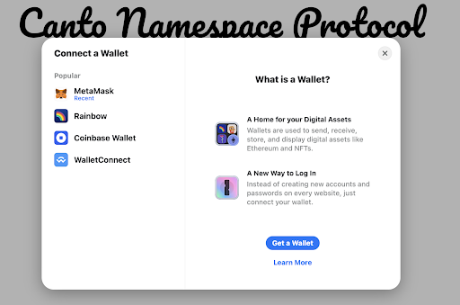
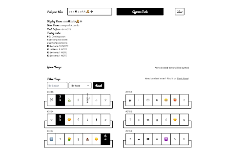
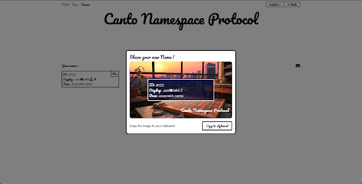

# Canto Namespace Protocol

Welcome to the Canto Namespace Protocol guide. This guide will walk you through the process of creating and minting your own unique Canto Namespace NFT.

## Understanding Canto Namespace Protocol

The **Canto Namespace Protocol (CNP)** enables users to create on-chain display names with stylized letters, numbers, and emojis. Unlike other naming protocols, CNP empowers users with self-expression by offering a wide range of naming options. The protocol operates within the broader **Canto Identity Protocol**, which aims to redefine on-chain identity.

## Getting Started

Before you begin, make sure you've completed the following steps:

[Bridged funds over to Canto](https://docs.canto.io/user-guides/bridging-assets/to-canto)
You must have $NOTE in your wallet as that is how you mint Trays.

## Creating Your Namespace

To generate a Canto Namespace NFT, users need to acquire **Character Tray NFTs** initially. Each Tray NFT contains 7 tiles featuring random combinations of letter characters and emojis. Within these Tray NFTs, users can handpick the tiles or characters they wish to fuse together to form their desired name. Note that any unused characters from a tray are burnt, regardless of the number of tiles used from that specific tray. Once the characters are fused, the user successfully creates a Canto Namespace NFT.

## Step-by-Step Instructions

### Step 1: Connecting your Wallet

1. Click on "Connect Wallet" in the top right-hand corner of the interface.
2. If this is your first time connecting to Canto Namespace, choose your preferred wallet option.

### Step 2: Minting Trays

1. Use the + or - buttons to select the number of trays you want to mint. Each tray contains 7 letter characters or emojis.
2. Remember that you'll need to mint enough trays to get the characters needed for your desired name.
3. Click "Mint [X] Trays," then approve and confirm the transaction in your wallet.

### Step 3: Creating your Namespace

1. Once your transaction is complete, you'll see the trays with their characters in the Fuse Interface.
2. Start building your name by clicking on the character tiles in your desired order.
3. When you've picked your tiles, you'll see the display, base name, and fusion cost.
4. Click "Fuse" and confirm the transaction in your wallet.

Pricing for Fusing:
- 8 Letters: 64 NOTE
- 9 Letters: 32 NOTE
- 10 Letters: 16 NOTE
- 11 Letters: 8 NOTE
- 12 Letters: 1 NOTE
- 13 Letters: 1 NOTE

**Note**: You can use multiple tiles from a single tray. After fusing a name, the trays used will be burnt, regardless of how many tiles are used. Only letters count toward the "base name," emojis do not. Names must be between 8 to 13 letters.

### Step 4: Your Namespace

Once fusing is complete, your "Names" will display with your ID#, Display name, and Base name. Share your unique Canto Namespace on Twitter to showcase your identity!

# FAQ

## Do I need to mint multiple trays?
**Q:** Do I need to mint multiple trays?
**A:** Each tray contains a collection of characters, letters, and emojis. To form your desired name, you might need to pick characters from different trays. Minting multiple trays increases your chances of finding the specific characters you want.

## Can I use multiple characters from each tray?
**Q:** Can I use multiple characters from each tray?
**A:** Yes, you can! You have the freedom to combine characters from different trays to create your unique display name.

## What can I do if I need 1 specific letter and don't want to mint another tray?
**Q:** What can I do if I need 1 specific letter and don't want to mint another tray?
**A:** Head over to BlankRasa.com where you can purchase unused trays.

## What happens to a tray once it's used for fusing?
**Q:** What happens to a tray once it's used for fusing?
**A:** Once you use a tray for fusing, it's burnt and cannot be used again. Make sure to pick characters wisely from each tray.

## Are unused trays burnt as well?
**Q:** Are unused trays burnt as well?
**A:** No, unused trays are not burnt. They remain in your wallet, allowing you to save them for future use.
**B:** You can also sell them on the secondary market on BlankRasa.com

## What are the requirements for naming?
**Q:** What are the requirements for naming?
**A:** Your name must be between 8 to 13 letters. Remember that only letters count toward the "base name," emojis do not contribute to the character count.

## How are the fusing costs determined?
**Q:** How are the fusing costs determined?
**A:** Fusing costs vary based on the number of letters in your name. The longer the name, the higher the cost. Here's the breakdown:
- 8 Letters: 64 NOTE
- 9 Letters: 32 NOTE
- 10 Letters: 16 NOTE
- 11 Letters: 8 NOTE
- 12 Letters: 1 NOTE
- 13 Letters: 1 NOTE
